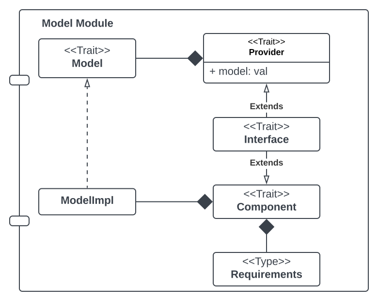
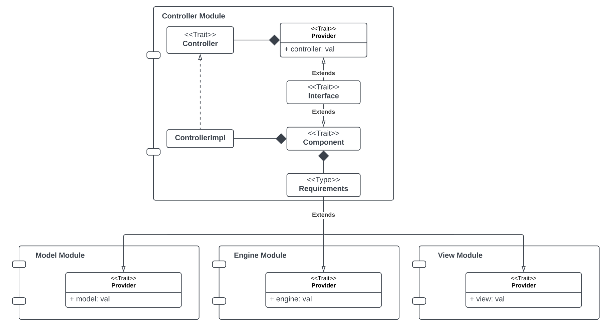

## Design di dettaglio

In questa sezione verrà analizzata nel dettaglio la struttura dell'applicativo andando a descrivere i singoli componenti e le relazioni fra loro.

### Component programming & Cake Pattern

Come descritto nella sezione precedente, si è deciso di utilizzare il pattern architetturale MVC. Per agevolare l'implementazione di questa scelta si è deciso di utilizzare il Cake Pattern, questo permette di iniettare le dipendenze fra i vari componenti in modo semplice e dichiarativo utilizzando aspetti avanzati della programmazione funzionale tra cui: *self-type*, *mix-in* e *type-members*. Nello specifico ogni componente che si desidera implementare deve avere cinque aspetti principali:
1. Un trait che definisce l'interfaccia del componente;
2. Un trait `Provider` che definisce il riferimento al componente tramite una singleton-like val;
3. Un type-member `Requirements` che definisce, in modo dichiarativo, le dipendenze di altri componenti di cui ha bisogno per svolgere i propri compiti (queste verranno mixed-in dai provider degli altri componenti in modo automatico);
4. Un trait `Component` che definisce l'implementazione effettiva del componente;
5. Un trait `Interface` che si occupa di aggregare gli altri elementi del modulo per renderlo effettivamente utilizzabile.

Un esempio di modulo view implementato utilizzando questo pattern è il seguente:

```scala
object ViewModule:

  trait View:
    def show(vitualTime: Int): Unit

  trait Provider:
    val view: View

  type Requirements = ControllerModule.Provider

  trait Component:
    context: Requirements =>
    class ViewImpl extends View:
      private val gui = MonadicGui()
      def show(virtualTime: Int): Unit = gui render virtualTime

  trait Interface extends Provider with Component:
    self: Requirements =>
```

Sfruttando questo pattern avanzato si è dunque deciso di implementare quattro moduli: Model, View, Controller ed Engine. Le dipendenze fra i vari moduli sono le seguenti: 
- View -> Controller
- Controller -> Model, Engine, View
- Engine -> View, Model, Controller

Di seguito è riportata una sezione per la descrizione dettagliata di ogni modulo.


### Model


### View


### Controller


### Engine


### Pattern utilizzati

#### Pimp my library

Pimp my library è un pattern che può essere utilizzato per aggiungere un nuovo metodo ad una classe senza modificare il suo codice, è molto utile quando tale classe viene da una libreria di terze parti e non si ha la possibilità di modificare il codice esistente. É stato usato per arricchire: *Interi*, *Tuple2*, *Option*, *HashMap* e *JPanel*. Un esempio esplicativo è il seguente, è sorta la necessità di avere un metodo per aggiungere una lista di elementi ad un pannello di classe `JPanel` senza scorrere esplicitamente tale lista, la soluzione dunque è stata arricchire la classe JPanel con il seguente metodo:
```scala
object RichJPanel:
    extension (p: JPanel)
      def addAll[E <: Component](elements: List[E]): Unit =
        elements.foreach(p.add(_))
```

#### Factory

Questo pattern è stato utilizzato nella sua versione classica in Scala, ovvero, utilizzando l'accoppiata trait - companion object per mantenere private le implementazioni di alcune classi. Ad esempio prendiamo un estratto della classe LineChart:
```scala 
trait LineChart:
  def addValue(x: Double, y: Double, series: String): Unit
 
object LineChart:

  def apply(title: String, xLabel: String, yLabel: String): LineChart =
    new LineChartImpl(title, xLabel, yLabel)

  private class LineChartImpl(_title: String, xLabel: String, yLabel: String) extends LineChart:
    ...

```

#### Facade

Facade è un pattern molto utile per nascondere la complessità di alcuni blocchi di codice, è stato utilizzato per fornire un'interfaccia semplificata per l'utilizzo dei grafici della libreria [JFreeChart](https://www.jfree.org/jfreechart/). Questa libreria, infatti, prevede l'utilizzo di diverse classi al fine di comporre un unico grafico (e.g. *ChartPanel*, *XYSeries*, *XYSeriesCollection*, ecc...). Grazie a facade siamo riusciti a fornrie un'interfaccia più intuitiva e semplice da utilizzare evitando di sporcare la classe dove vengono creati i grafici e poi aggiunti al relativo pannello della GUI. I metodi esposti da questa implementazione sono i seguenti:

```scala 
/** Scala facade for a 2D JFreeChart Line Chart */
trait LineChart:
  def addValue(x: Double, y: Double, series: String): Unit
  def wrapToPanel(): ChartPanel
  def addSeries(name: String, color: Color): Unit
  def title: String

```
#### Strategy

Il pattern Strategy è direttamente supportato in Scala dalla presenza delle funzioni higher-order. Un esempio di utilizzo è il seguente nel SimulationEngine:
```scala 
private def updateParameter[E](sector: Sector, onStraight: () => E, onTurn: () => E): E = sector match
        case s: Straight => onStraight()
        case t: Turn => onTurn()
```
Difatti, `updateParameter` è un metodo higher-order al quale possiamo "inniettare" dall'esterno la strategia da utilizzare.

#### Singleton

Esattamente come Strategy anche il pattern Singleton è direttamente supportato in Scala, questo pattern prevede che di una data classe si possa avere una e una sola istanza, questo obbiettivo è facilmente raggiungibile utilizzando gli `object`. Un esempio è il singleton `ImageLoader`:
```scala 
object ImageLoader:
  def load(file: String): ImageIcon = ImageIcon(ImageLoader.getClass.getResource(file))

```

#### Adapter

Il pattern Adapter viene utilizzato ogni qual volta si presenti un problema di incompatibilità fra due elementi distinti che devono coesistere all'interno del software. In Scala è facilmente implementabile attraverso il meccanismo delle `given conversion`. Nel progetto è stato molto utilizzato in diversi punti: costruzione di una view monadica e cooperazione Scala-Prolog.
```scala 
 given Conversion[JFrame, Task[JFrame]] = Task(_)
 given Conversion[JPanel, Task[JPanel]] = Task(_)
 given Conversion[String, Term] = Term.createTerm(_)
 given Conversion[Seq[_], Term] = _.mkString("[", ",", "]")
 ...
```
